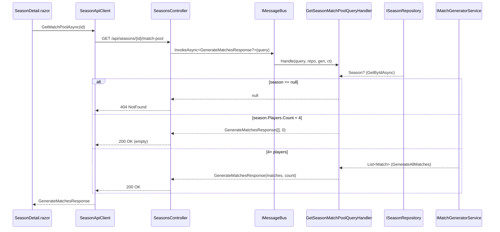

# Season Match Pool — Design

Technical design for the change described in
`docs/epics/epic3-season-match-planning/season-match-pool/change.md`.
Problem, business rules and acceptance criteria live in `change.md`; this
document covers the technical approach, architecture decisions, data flow and
file changes.

## Technical Approach

Add a read-only CQRS query `GetSeasonMatchPoolQuery(int SeasonId)` that computes
the full doubles match pool on demand from a season's enrolled players. The pool
is never persisted — it is regenerated from `season.Players` on every request
via the existing `IMatchGeneratorService.GenerateAllMatches`.

The handler loads the season through `ISeasonRepository.GetByIdAsync`. An unknown
season yields a `null` result (controller maps to 404). A known season with fewer
than four players yields an empty `GenerateMatchesResponse` (`Matches` empty,
`TotalCount` 0) — HTTP 200. Four-or-more players yields the generated pool mapped
to `GenerateMatchesResponse`.

The endpoint is `GET /api/seasons/{id}/match-pool` on the existing
`SeasonsController`, following the same `IMessageBus.InvokeAsync<T>` /
null-to-`NotFound` pattern already used by `GetMatchdays` and `GetPlayers`. The
Blazor client gets a `GetMatchPoolAsync(int seasonId)` method and the season
detail page renders the pool in a collapsible, paged `MudTable`.

## Architecture Decisions

### Decision: Handler returns `GenerateMatchesResponse?` (nullable), not a sentinel

**Alternatives**: Throw `KeyNotFoundException` for unknown season; return a flag DTO.
**Rationale**: The existing read-side convention (`GetSeasonByIdQueryHandler`,
`GetSeasonPlayersQueryHandler`) returns `null` for "not found" and lets the
controller translate it to 404. Reusing that keeps the controller branch
identical to its siblings (`season == null ? NotFound() : Ok(...)`). The
"<4 players" case is a legitimate 200 with an empty pool, so it returns a
non-null empty response — null is reserved strictly for unknown season.

### Decision: Reuse `GenerateMatchesResponse` / `MatchDto` / `TeamDto` / `PlayerDto` as-is

**Alternatives**: Introduce a season-specific match-pool DTO.
**Rationale**: The shape (list of matches + total count) is identical to the
existing match-generation response, and Story 2 will key off the same
deterministic match IDs. A new DTO would duplicate structure with no added
information.

### Decision: Add a `GenerateMatchesResponse` factory on the existing `MatchMapper`

**Alternatives**: Inline the `Select(...).ToList()` projection in the handler
(as `GenerateMatchesCommandHandler` does today).
**Rationale**: Two handlers now build the same response from a `List<Match>`. A
single mapper extension (e.g. `ToResponse(this IReadOnlyList<Match>)`) removes
the duplication and is the established Mappers pattern. `GenerateMatchesCommandHandler`
is refactored to use it so both call sites share one projection.

### Decision: Paged `MudTable` with server-unaware client paging

**Alternatives**: Render all rows; virtualize.
**Rationale**: The pool grows combinatorially (10 players → 630 matches,
20 → 14,535). The full list is already in memory client-side after one fetch, so
MudTable's built-in pager (`Items` + paging) keeps the DOM small without extra
round-trips. The fetch happens once, lazily, when the panel is expanded.

## Data Flow

## File Changes Overview

**Create**

- `src/Winterplein.Application.IO/Queries/GetSeasonMatchPoolQuery.cs`
- `src/Winterplein.Application/QueryHandlers/GetSeasonMatchPool/GetSeasonMatchPoolQueryHandler.cs`
- `tests/Winterplein.Application.UnitTests/Seasons/SeasonMatchPoolHandlerTests.cs`
- `tests/Winterplein.IntegrationTests/Seasons/SeasonMatchPoolTests.cs`

**Modify**

- `src/Winterplein.Application/Mappers/MatchMapper.cs` (add `ToResponse` factory)
- `src/Winterplein.Application/CommandHandlers/GenerateMatches/GenerateMatchesCommandHandler.cs` (use new mapper)
- `src/Winterplein.WebApi/Controllers/SeasonsController.cs` (add endpoint)
- `src/Winterplein.Client/Services/SeasonApiClient.cs` (add `GetMatchPoolAsync`)
- `src/Winterplein.Client/Pages/SeasonDetail.razor` (add match-pool panel)

## Key Patterns Reused

- Query record in `Application.IO/Queries/`; static `Handle` handler under
  `Application/QueryHandlers/<QueryName>/` with Wolverine dependency injection by
  method parameter (`GetSeasonPlayersQueryHandler` is the closest analogue).
- Controller null→`NotFound` translation (`GetMatchdays`, `GetPlayers`).
- Domain→DTO extension mappers in `Application/Mappers/` (`MatchMapper.ToDto`).
- `SeasonApiClient` `GetAsync` + `HttpStatusCode.NotFound` short-circuit pattern.
- Unit tests with `Moq` + builders (`SeasonBuilder`, `PlayerBuilder`) in
  `SeasonHandlerTests`; integration tests in `IntegrationTestBase` with HTTP
  round-trips and `SeasonSeedBuilder`.
