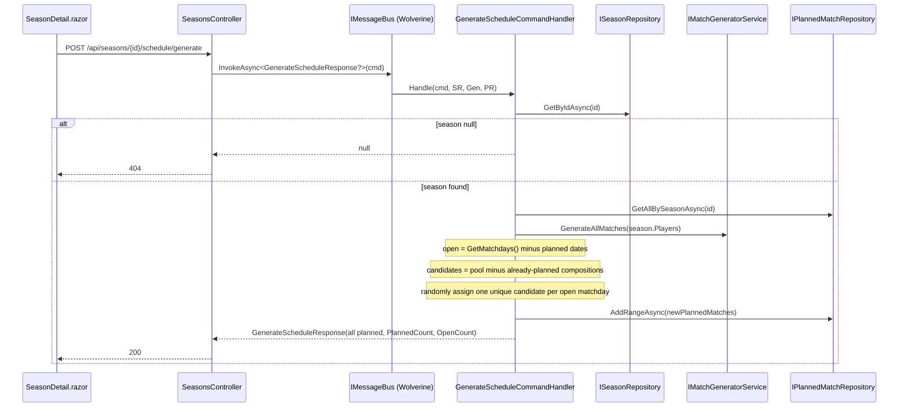

# season-schedule-generation Design

## Technical approach

Add a `PlannedMatch` persisted entity that stores a **frozen, denormalized snapshot** of a match assigned to a single season matchday. A new `GenerateScheduleCommand` handler computes the season's open matchdays (`Season.GetMatchdays()` minus dates already planned), derives the match pool from the enrolled players via the existing `IMatchGeneratorService`, excludes any pool match whose player composition is already planned this season, then randomly assigns one unique remaining match to each open matchday and persists the results. The endpoint is idempotent: re-running only fills still-open matchdays.

The feature reuses the established Clean Architecture / CQRS-over-Wolverine slice pattern already used by `GetSeasonMatchPool` (handler -> `ISeasonRepository` + `IMatchGeneratorService`) and the season command handlers (static `Handle`, repository ports, EF implementation registered Scoped). The only genuinely new infrastructure is the `PlannedMatch` table and its repository.

## Architecture decisions

### Decision: Persist the match snapshot as EF owned types (no FK to Player)

**Alternatives**: (a) FK relationships to `Player`/`Team` like `Match`/`Team` configs; (b) a single serialized JSON column.
**Rationale**: The change locks in a _frozen snapshot_ with no FK to `Player`, so a later rename/removal cannot mutate or break history. Owned types (`PlannedMatch` owns two teams, each owning two player snapshots) give first-class, queryable columns (`Team1Player1FirstName`, `...Gender`, `...PlayerId`, etc.) in the `PlannedMatches` table without any foreign key — matching the existing owned-`Name` pattern in `PlayerConfiguration`. JSON would be opaque to the season-wide uniqueness query and harder to assert in tests.

### Decision: Carry the original player Id inside each player snapshot

**Alternatives**: Store only name + gender; recompute uniqueness from names.
**Rationale**: Season-wide uniqueness must compare a candidate pool match's four player ids + pairing against already-planned matches (change.md "Potential Pitfalls"). Storing the source `PlayerId` per snapshot player (a denormalized value, not an FK) lets uniqueness be computed by player composition robustly even if names collide. The Id is a frozen value copied at plan time; deleting the player later does not cascade.

### Decision: Track uniqueness by player composition, never by pool match Id

**Alternatives**: Persist the transient sequential pool match Id.
**Rationale**: Pool match Ids are recomputed each request and depend on the current player set, so they are not stable identity. A "team pairing key" derived from the four player ids (each team = unordered pair, the two teams unordered) uniquely identifies a match regardless of pool ordering or roster changes.

### Decision: Unknown season -> handler returns `null`, controller returns 404

**Alternatives**: Throw `KeyNotFoundException` and let `GlobalExceptionHandler` map it.
**Rationale**: Mirrors the sibling `GetSeasonMatchPool` slice exactly (nullable response -> `NotFound()`), keeping the read-then-write surface consistent. Empty pool (< 4 players) is a valid 200 with an all-open plan, not an error.

### Decision: Shared thread-safe RNG via `Random.Shared`

**Alternatives**: Inject an RNG abstraction; per-call `new Random()`.
**Rationale**: `Random.Shared` is thread-safe and requires no DI wiring. Tests assert structural invariants (uniqueness, counts), not specific selections, so a fixed seed is unnecessary.

## Data flow

## File changes overview

**Created**

- `src/Winterplein.Domain/Entities/PlannedMatch.cs` — entity + owned snapshot types
- `src/Winterplein.Application.IO/DTOs/PlannedMatchDto.cs`
- `src/Winterplein.Application.IO/DTOs/GenerateScheduleResponse.cs`
- `src/Winterplein.Application.IO/Commands/GenerateScheduleCommand.cs`
- `src/Winterplein.Application/Ports/IPlannedMatchRepository.cs`
- `src/Winterplein.Application/Mappers/PlannedMatchMapper.cs`
- `src/Winterplein.Application/CommandHandlers/GenerateSchedule/GenerateScheduleCommandHandler.cs`
- `src/Winterplein.Infrastructure/Repositories/EfPlannedMatchRepository.cs`
- `src/Winterplein.Infrastructure/Configurations/PlannedMatchConfiguration.cs`
- `src/Winterplein.Infrastructure/Migrations/<timestamp>_AddPlannedMatches.cs` (+ Designer)
- `tests/Winterplein.Common.UnitTests/Builders/PlannedMatchBuilder.cs`
- `tests/Winterplein.Application.UnitTests/Seasons/GenerateScheduleHandlerTests.cs`
- `tests/Winterplein.IntegrationTests/Seasons/SeasonScheduleTests.cs`

**Modified**

- `src/Winterplein.Infrastructure/WinterpleinDbContext.cs` — add `DbSet<PlannedMatch>`
- `src/Winterplein.Infrastructure/Migrations/WinterpleinDbContextModelSnapshot.cs` — regenerated by migration
- `src/Winterplein.WebApi/Configuration/IocConfig.cs` — register `IPlannedMatchRepository`
- `src/Winterplein.WebApi/Controllers/SeasonsController.cs` — add POST schedule/generate
- `src/Winterplein.Client/Services/SeasonApiClient.cs` — add `GenerateScheduleAsync`
- `src/Winterplein.Client/Pages/SeasonDetail.razor` — Generate Schedule button + snackbar

## Key patterns reused

- Owned-type EF mapping for denormalized value data — extends the owned `Name` pattern in `PlayerConfiguration`.
- Static Wolverine `Handle(command, ...deps)` handler under `CommandHandlers/<Name>/`.
- Async + Scoped EF repository behind an `Application/Ports` interface (mirrors `EfSeasonRepository`).
- Nullable-response read-then-write slice -> controller maps `null` to `NotFound()` (mirrors `GetMatchPool`).
- Domain->DTO extension-method mapper in `Application/Mappers`.
- `SeasonApiClient` `PostAsJsonAsync` + shared `_json` (enum converter); MudBlazor button + snackbar in `SeasonDetail.razor`.
- Integration tests over real SQL Server + Respawn (`IntegrationTestBase`), unit tests with Moq + builders.

## Uniqueness / matchday derivation notes

- **Composition key**: for a `Match`, build a normalized key from the two teams where each team is the unordered pair of its player ids and the two teams are themselves unordered (e.g. sort the two `{minId,maxId}` pairs). Two matches collide iff their keys are equal. The same key is computed from a persisted `PlannedMatch` snapshot using its stored player ids.
- **Open matchdays**: `Season.GetMatchdays()` minus the set of `PlannedMatch.Date` already stored for that season. Idempotent re-runs therefore touch only the remaining dates.
- **Partial fill**: if remaining unique candidates < open matchdays, fill as many as possible; `OpenCount` reflects the unfilled remainder.
  </content>
  </invoke>
