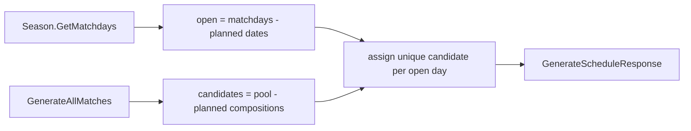

# generate-schedule-handler

## Scope

Implement the schedule generation use case as a Wolverine static handler, plus the snapshot mapper.

`GenerateScheduleCommandHandler.Handle(GenerateScheduleCommand, ISeasonRepository, IMatchGeneratorService, IPlannedMatchRepository, CancellationToken)`:

- Load season; if null return `null` (controller -> 404).
- Load existing `PlannedMatch` list for the season via `GetAllBySeasonAsync`.
- Open matchdays = `season.GetMatchdays()` minus dates already present in the existing planned matches.
- Pool = `generator.GenerateAllMatches(season.Players)` (empty when < 4 players).
- Candidates = pool matches whose composition key is NOT already in the existing planned set (season-wide uniqueness by player composition, never by transient pool Id).
- Randomly (shared RNG) assign one unique candidate per open matchday until candidates or open matchdays are exhausted; build a `PlannedMatch` snapshot for each assignment.
- Persist new planned matches via `AddRangeAsync`.
- Return `GenerateScheduleResponse` = all planned matches (existing + new) mapped to DTOs, `PlannedCount` = total planned, `OpenCount` = open matchdays still unfilled.

`PlannedMatchMapper.ToDto` / response mapper in `Application/Mappers/`. Composition-key helper (four player ids, unordered within each team and across the two teams) used to compare pool matches against snapshots.

## Domain model changes

None. Consumes `Match` (pool), `Season`, and produces `PlannedMatch` snapshots.

## Test cases

- GenerateScheduleHandlerTests.cs (Application.UnitTests/Seasons)
  - FillsEveryOpenMatchday_WithUniqueMatch
  - SkipsAlreadyPlannedMatchdays_OnRerun (existing planned untouched, only open filled)
  - PartialFill_WhenPoolSmallerThanOpenMatchdays_SetsOpenCount
  - SeasonWideUniqueness_NoCompositionAssignedTwice
  - EmptyPlan_WhenFewerThanFourPlayers (PlannedCount 0, OpenCount = all matchdays)
  - ReturnsNull_ForUnknownSeason

## Affected files

- create: src/Winterplein.Application/CommandHandlers/GenerateSchedule/GenerateScheduleCommandHandler.cs
- create: src/Winterplein.Application/Mappers/PlannedMatchMapper.cs
- create: tests/Winterplein.Common.UnitTests/Builders/PlannedMatchBuilder.cs
- create: tests/Winterplein.Application.UnitTests/Seasons/GenerateScheduleHandlerTests.cs
  </content>
