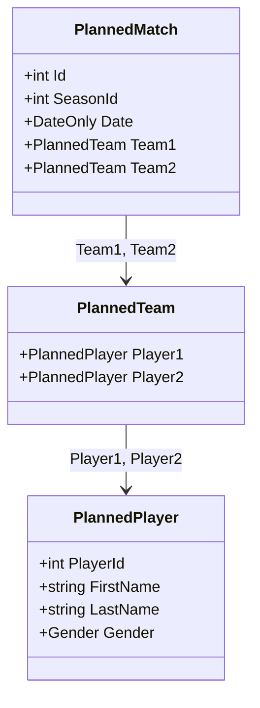

# planned-match-domain-and-dtos

## Scope

Add the `PlannedMatch` domain entity (frozen, denormalized match snapshot, no FK to `Player`) and the IO contracts for schedule generation.

- `PlannedMatch` entity: `Id`, `SeasonId`, `Date` (matchday), and a frozen snapshot of two teams, each with two player snapshots carrying `PlayerId` + `FirstName` + `LastName` + `Gender`. EF-compatible: private parameterless ctor, private setters. Public constructor validates that `Date` is not the default/empty `DateOnly`.
- Snapshot modelled so it can be persisted as EF owned types (see config task) — no navigation to `Player`/`Team`.
- `PlannedMatchDto` (Id, SeasonId, Date, Team1, Team2 as `TeamDto`) and `GenerateScheduleResponse(List<PlannedMatchDto> PlannedMatches, int PlannedCount, int OpenCount)` in `Application.IO/DTOs/`.
- `GenerateScheduleCommand(int SeasonId)` in `Application.IO/Commands/`.

## Domain model changes

`GenerateScheduleResponse` reuses existing `TeamDto`/`PlayerDto` shapes for the planned match teams.

## Test cases

- PlannedMatchTests.cs (Domain.UnitTests)
  - Constructs_WithValidSnapshotAndDate
  - Throws_ForDefaultDate
  - Snapshot_ExposesPlayerIdNameAndGender

## Affected files

- create: src/Winterplein.Domain/Entities/PlannedMatch.cs
- create: src/Winterplein.Application.IO/DTOs/PlannedMatchDto.cs
- create: src/Winterplein.Application.IO/DTOs/GenerateScheduleResponse.cs
- create: src/Winterplein.Application.IO/Commands/GenerateScheduleCommand.cs
- create: tests/Winterplein.Domain.UnitTests/PlannedMatchTests.cs
  </content>
