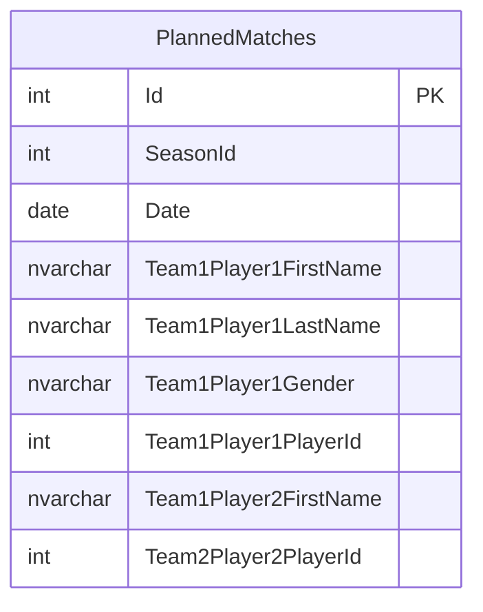

# planned-match-persistence

## Scope

Wire `PlannedMatch` into EF Core and expose it through a repository port.

- Add `DbSet<PlannedMatch> PlannedMatches` to `WinterpleinDbContext`.
- `PlannedMatchConfiguration` (`IEntityTypeConfiguration<PlannedMatch>`): key + identity `Id`; `SeasonId` and `Date` (`HasColumnType("date")`) as scalar columns (no FK relationship to `Season`); map `Team1`/`Team2` as owned types, each owning two player snapshots with named columns (`Team1Player1FirstName`, `Team1Player1PlayerId`, `Gender` via `HasConversion<string>()`, etc.) — NO foreign key to `Player`. Auto-discovered by `ApplyConfigurationsFromAssembly`.
- `IPlannedMatchRepository` (async, `Application/Ports/`): `GetAllBySeasonAsync(int seasonId, CancellationToken)` and `AddRangeAsync(IEnumerable<PlannedMatch>, CancellationToken)`.
- `EfPlannedMatchRepository` in `Infrastructure/Repositories/`, registered Scoped in `IocConfig`.
- New EF migration `AddPlannedMatches` (creates `PlannedMatches` table with owned-type columns; no FKs). Regenerate the model snapshot.

## Domain model changes

No domain changes. Persistence mapping only:

(Columns shown abbreviated; four player snapshots total across Team1/Team2, each with FirstName/LastName/Gender/PlayerId. No foreign keys.)

## Test cases

- Covered by the integration tests in the api-endpoint task (round-trip persistence). No dedicated infra unit test required; if added, place EfPlannedMatchRepository round-trip assertions in the integration suite.

## Affected files

- create: src/Winterplein.Application/Ports/IPlannedMatchRepository.cs
- create: src/Winterplein.Infrastructure/Repositories/EfPlannedMatchRepository.cs
- create: src/Winterplein.Infrastructure/Configurations/PlannedMatchConfiguration.cs
- create: src/Winterplein.Infrastructure/Migrations/<timestamp>\_AddPlannedMatches.cs (+ .Designer.cs)
- modify: src/Winterplein.Infrastructure/WinterpleinDbContext.cs
- modify: src/Winterplein.Infrastructure/Migrations/WinterpleinDbContextModelSnapshot.cs
- modify: src/Winterplein.WebApi/Configuration/IocConfig.cs
  </content>
