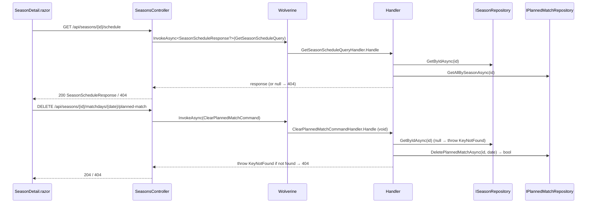

# season-schedule-management Design

## Technical approach

Add a read model (`GetSeasonScheduleQuery`) that projects a season's full set of computed matchdays onto its persisted planned matches, plus two write operations (`ClearPlannedMatchCommand`, `ClearAllPlannedMatchesCommand`) that delete planned matches. The clear operations follow the established void-handler + `KeyNotFoundException` → 404 convention; deletion logic lives in `IPlannedMatchRepository` (which may return value types) so the Wolverine handler can decide whether to throw.

The schedule read combines two sources already available in a single handler:

- `Season.GetMatchdays()` → the ordered list of every matchday `DateOnly` for the season.
- `IPlannedMatchRepository.GetAllBySeasonAsync(seasonId)` → the persisted planned matches.

The handler left-joins matchdays to planned matches by `Date`, producing one `MatchdayScheduleEntryDto` per matchday (planned or open), ordered by date. Unknown season → `null` → 404.

On the client, the Story-2 flat planned-matches `MudTable` (bound to `GenerateScheduleResponse`) is replaced by a matchday-by-matchday table bound to `SeasonScheduleResponse`, loaded from the new `GET /schedule` endpoint. The Generate Schedule button stays and refreshes the schedule after generating. Each planned row gets a Clear button; a Clear All button (with confirmation dialog) clears the whole season.

## Architecture decisions

### Decision: Schedule overview is a query-side read model, not derived client-side

**Alternatives**: Have the client call `GET /matchdays` and `GET /schedule/generate` result separately and merge; reuse `GenerateScheduleResponse`.
**Rationale**: The matchday/planned join is domain logic (matchdays come from `Season.GetMatchdays()`). Computing it server-side keeps the client thin (it only references `Application.IO`) and gives a single 200/404 contract. `GenerateScheduleResponse` is a flat planned-only list with counts — it cannot express "open" matchdays in date order, which is the core of this story.

### Decision: Clear commands are void handlers that throw `KeyNotFoundException`

**Alternatives**: Return a bool/int result from the Wolverine handler and let the controller map it.
**Rationale**: Wolverine cannot return value types from `InvokeAsync<T>`. The codebase already standardises on void `Handle` + `KeyNotFoundException` → 404 (`DeleteSeasonCommandHandler`, `RemoveSeasonPlayerCommandHandler`) with `GlobalExceptionHandler` doing the mapping. The repository delete methods return value types (affected-row count / found flag) so the handler can decide whether to throw.

### Decision: Repository delete-by-date returns a found-flag; delete-all is unconditional

**Alternatives**: Both unconditional (handler re-queries to decide 404); both return counts.
**Rationale**: Clear-individual must 404 when no planned match exists at that date, so the repo signals "did I delete anything". Clear-all is idempotent (empty → still 204), so it only needs the season-existence check (done via `ISeasonRepository`) — the delete itself needs no return.

### Decision: Season existence for clear commands is checked via `ISeasonRepository.GetByIdAsync`

**Alternatives**: Infer unknown-season from "no planned matches deleted".
**Rationale**: A valid season can legitimately have zero planned matches (clear-all idempotent → 204). "No rows deleted" cannot distinguish unknown-season (404) from already-empty (204). An explicit season lookup disambiguates and matches `RemoveSeasonPlayerCommandHandler`.

## Data flow

## File changes overview

**Create**

- `src/Winterplein.Application.IO/DTOs/MatchdayScheduleEntryDto.cs`
- `src/Winterplein.Application.IO/DTOs/SeasonScheduleResponse.cs`
- `src/Winterplein.Application.IO/Queries/GetSeasonScheduleQuery.cs`
- `src/Winterplein.Application.IO/Commands/ClearPlannedMatchCommand.cs`
- `src/Winterplein.Application.IO/Commands/ClearAllPlannedMatchesCommand.cs`
- `src/Winterplein.Application/QueryHandlers/GetSeasonSchedule/GetSeasonScheduleQueryHandler.cs`
- `src/Winterplein.Application/CommandHandlers/ClearPlannedMatch/ClearPlannedMatchCommandHandler.cs`
- `src/Winterplein.Application/CommandHandlers/ClearAllPlannedMatches/ClearAllPlannedMatchesCommandHandler.cs`
- test files (see per-task)

**Modify**

- `src/Winterplein.Application/Ports/IPlannedMatchRepository.cs` (add 2 delete methods)
- `src/Winterplein.Infrastructure/Repositories/EfPlannedMatchRepository.cs` (implement)
- `src/Winterplein.WebApi/Controllers/SeasonsController.cs` (3 endpoints)
- `src/Winterplein.Client/Services/SeasonApiClient.cs` (3 methods)
- `src/Winterplein.Client/Pages/SeasonDetail.razor` (replace schedule table)

## Key patterns reused

- Query handler returning nullable DTO; controller `?? NotFound()` (`GetSeasonMatchPoolQueryHandler` / `GetMatchPool`).
- Void clear handler + `KeyNotFoundException` (`RemoveSeasonPlayerCommandHandler`); controller `await bus.InvokeAsync(cmd); return NoContent()`.
- API client delete → 404-as-bool (`RemovePlayerFromSeasonAsync`); GET-as-null-on-404 (`GetMatchPoolAsync`).
- EF repository over `WinterpleinDbContext`, in-memory provider for infra unit tests (`EfSeasonRepositoryTests`); real SQL Server + Respawn for integration (`SeasonScheduleTests`).
- Mappers as extension methods (`PlannedMatchMapper.ToDto`).
- MudTable + confirmation via `DialogService.ShowMessageBoxAsync` (existing `ConfirmRemovePlayer`).
