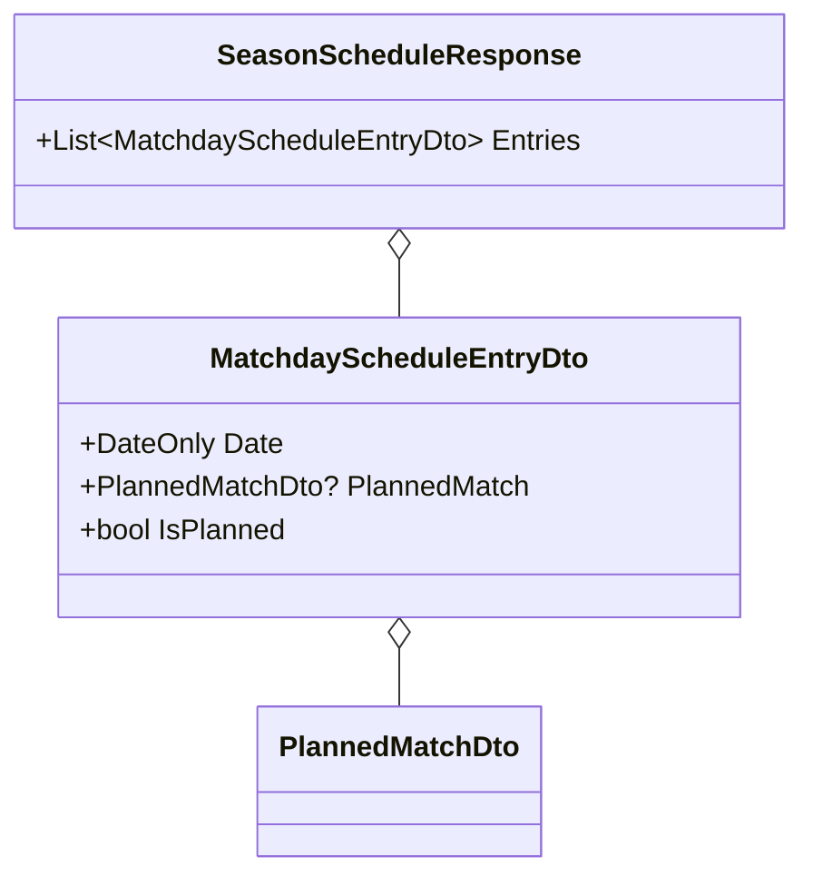

# io-contracts

## Scope

Add the schedule read/write contracts in `Winterplein.Application.IO`. No handlers, no logic.

- DTO `MatchdayScheduleEntryDto(DateOnly Date, PlannedMatchDto? PlannedMatch, bool IsPlanned)`
- DTO `SeasonScheduleResponse(List<MatchdayScheduleEntryDto> Entries)` (entries ordered by date by the producer)
- Query `GetSeasonScheduleQuery(int SeasonId)`
- Command `ClearPlannedMatchCommand(int SeasonId, DateOnly Date)`
- Command `ClearAllPlannedMatchesCommand(int SeasonId)`

These are plain records in the same style/namespaces as existing ones (`Winterplein.Application.IO.DTOs`, `.Queries`, `.Commands`). `PlannedMatchDto` already exists and is reused.

## Domain model changes

## Test cases

None — declaration-only records; exercised by handler/integration tests in later tasks. Verify via `dotnet build`.

## Affected files

- create: src/Winterplein.Application.IO/DTOs/MatchdayScheduleEntryDto.cs
- create: src/Winterplein.Application.IO/DTOs/SeasonScheduleResponse.cs
- create: src/Winterplein.Application.IO/Queries/GetSeasonScheduleQuery.cs
- create: src/Winterplein.Application.IO/Commands/ClearPlannedMatchCommand.cs
- create: src/Winterplein.Application.IO/Commands/ClearAllPlannedMatchesCommand.cs
