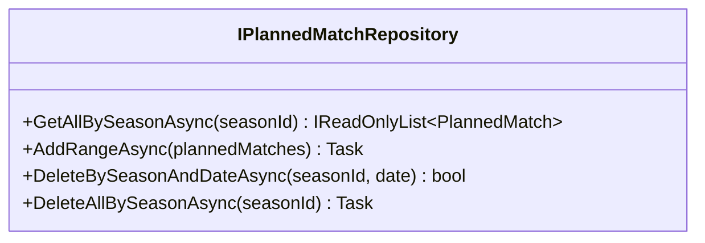

# repository-deletes

## Scope

Add async delete methods to `IPlannedMatchRepository` and implement them in `EfPlannedMatchRepository`. The repository (not a Wolverine handler) MAY return value types so handlers can decide whether to throw.

- `Task<bool> DeleteBySeasonAndDateAsync(int seasonId, DateOnly date, CancellationToken ct = default)` — deletes the planned match at that season+date; returns `true` if a row was deleted, `false` if none existed.
- `Task DeleteAllBySeasonAsync(int seasonId, CancellationToken ct = default)` — deletes all planned matches for the season; no return (idempotent).

EF implementation queries `_db.PlannedMatches` filtered by `SeasonId` (and `Date`), removes the matched entities, and calls `SaveChangesAsync`. Mirror the existing `GetAllBySeasonAsync` / `AddRangeAsync` style.

## Domain model changes

None. New repository methods only.

## Test cases

Infrastructure unit tests over the in-memory provider (style of `EfSeasonRepositoryTests`), new file `EfPlannedMatchRepositoryTests.cs`:

- DeleteBySeasonAndDate_RemovesMatch_AndReturnsTrue
- DeleteBySeasonAndDate_ReturnsFalse_WhenNoMatchAtDate
- DeleteBySeasonAndDate_DoesNotAffectOtherSeasonsOrDates
- DeleteAllBySeason_RemovesEveryMatchForSeason
- DeleteAllBySeason_IsNoOp_WhenSeasonHasNoMatches
- DeleteAllBySeason_DoesNotAffectOtherSeasons

Use `PlannedMatchBuilder` and `AddRangeAsync` to seed.

## Affected files

- modify: src/Winterplein.Application/Ports/IPlannedMatchRepository.cs
- modify: src/Winterplein.Infrastructure/Repositories/EfPlannedMatchRepository.cs
- create: tests/Winterplein.Infrastructure.UnitTests/EfPlannedMatchRepositoryTests.cs
