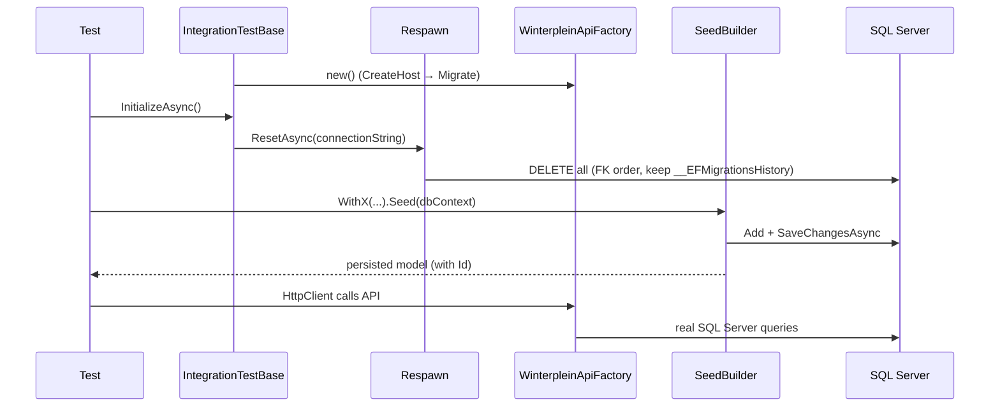

# integration-tests-real-database Design

## Technical approach

Replace the SQLite in-memory `WinterpleinApiFactory` with a factory that targets a real SQL Server database (`Winterplein_integrationTests`). The factory reads its connection string from a test `appsettings.json` shipped with the IntegrationTests project, overrides the `WinterpleinDbContext` registration to `UseSqlServer`, and applies EF Core migrations on host creation (`db.Database.Migrate()`).

Per-class factory instantiation stays. A new abstract base class implementing `IAsyncLifetime` runs Respawn against the shared database in `InitializeAsync` (before each test body), so each test starts empty while the previous run's data lingers for inspection. The factory exposes a way to create a `WinterpleinDbContext` scope so seed builders and the Respawn reset can reach the database directly.

Tests that need pre-existing state use new fluent seed builders (one per entity) that write through EF Core. Existing tests that already build state via API calls are left untouched except for adopting the base class.

xUnit parallelization is disabled project-wide (shared physical DB).

## Architecture decisions

### Decision: Apply migrations on startup via `Database.Migrate()`, not `EnsureCreated()`

**Alternatives**: `EnsureCreated()` (current SQLite behaviour), DACPAC/manual provisioning.
**Rationale**: `Migrate()` exercises the exact production schema and surfaces migration drift in tests, which is the point of running against real SQL Server. `EnsureCreated()` bypasses migrations and would not catch drift.

### Decision: Clear data BEFORE each test with Respawn (not after)

**Alternatives**: Clear after each test, transaction-rollback per test, fresh DB per class.
**Rationale**: Locked by explore phase. Clearing before leaves the last test's data for inspection. Transaction rollback does not survive the out-of-process HTTP boundary of `WebApplicationFactory`. Respawn deletes in FK order and is the chosen library.

### Decision: Shared clear hook via an `IAsyncLifetime` base class

**Alternatives**: xUnit collection fixture with shared factory, `IClassFixture`.
**Rationale**: Keeps the per-class factory model the explore phase locked in. `IAsyncLifetime.InitializeAsync` runs before each test, giving a natural place for the Respawn reset without changing how factories are created.

### Decision: Disable parallelization project-wide via an assembly attribute

**Alternatives**: Per-collection `[Collection]` grouping.
**Rationale**: All classes share one physical DB; the simplest correct option is `[assembly: CollectionBehavior(DisableTestParallelization = true)]`.

### Decision: Seed builders live in the IntegrationTests project, write through EF Core

**Alternatives**: Reuse `UnitTests.Common` domain builders, seed via API.
**Rationale**: Follows the locked Koala `*SeedBuilder` pattern (`With*` + `async Task<T> Seed(WinterpleinDbContext)`). Domain builders return entities but do not persist; API seeding is what these tests are trying to avoid for pre-existing state. Seeding through `WinterpleinDbContext` exercises the real provider and lets identity-generated IDs flow back via the returned model.

## Data flow

## File changes overview

- modify: `tests/Winterplein.IntegrationTests/Winterplein.IntegrationTests.csproj` — remove `Microsoft.EntityFrameworkCore.Sqlite`; add `Microsoft.EntityFrameworkCore.SqlServer`, `Respawn`, `Microsoft.Extensions.Configuration.Json`; ensure `appsettings.json` is copied to output.
- create: `tests/Winterplein.IntegrationTests/appsettings.json` — `ConnectionStrings:WinterpleinDb` → `Winterplein_integrationTests`.
- modify: `tests/Winterplein.IntegrationTests/WinterpleinApiFactory.cs` — drop SQLite; register `UseSqlServer` from config; `Migrate()` on host create; expose connection string + a `WinterpleinDbContext` scope accessor.
- create: `tests/Winterplein.IntegrationTests/IntegrationTestBase.cs` — abstract base, holds factory + client, `IAsyncLifetime` runs Respawn before each test.
- create: `tests/Winterplein.IntegrationTests/AssemblyInfo.cs` — `[assembly: CollectionBehavior(DisableTestParallelization = true)]`.
- create: `tests/Winterplein.IntegrationTests/SeedBuilders/PlayerSeedBuilder.cs`, `SeasonSeedBuilder.cs`.
- modify: existing test classes (`PlayersControllerTests`, `MatchesControllerTests`, `Seasons/SeasonsControllerTests`) — inherit `IntegrationTestBase`, drop per-class factory/dispose boilerplate.

## Key patterns

- Koala `HoofdlocatieSeedBuilder` pattern for the new seed builders (private fields + defaults, `With*` fluent setters, `async Task<T> Seed(WinterpleinDbContext)`).
- Existing `WebApplicationFactory<Program>` + DI descriptor-removal pattern for swapping the DbContext provider.
- Respawn `Checkpoint` configured with `TablesToIgnore = ["__EFMigrationsHistory"]` and SQL Server adapter; FK-order deletes are handled by Respawn automatically (covers `SeasonPlayers`, `Matches`, `Teams`).
