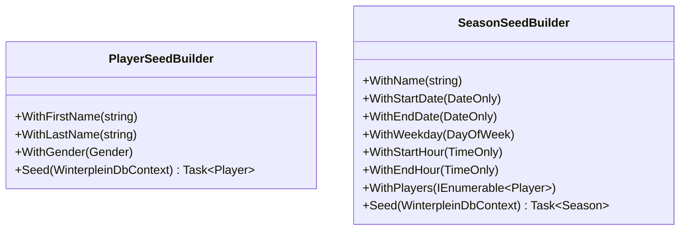

# seed-builders

## Scope

Add reusable fluent seed builders that persist entities directly through `WinterpleinDbContext`, following the locked Koala `*SeedBuilder` pattern (`With*` fluent setters with sensible defaults, plus `async Task<T> Seed(WinterpleinDbContext)` that `Add`s + `SaveChangesAsync` + returns the persisted model with its generated Id).

- `PlayerSeedBuilder`: defaults for name (first/last) and gender; `WithFirstName`, `WithLastName`, `WithGender`. `Seed` adds a `Player` and returns it.
- `SeasonSeedBuilder`: defaults for name, dates, weekday, hours; `WithName`, `WithStartDate`, `WithEndDate`, `WithWeekday`, `WithStartHour`, `WithEndHour`, `WithPlayers(IEnumerable<Player>)`. `Seed` adds a `Season` (attaching already-seeded players so the `SeasonPlayers` join is written) and returns it.
- Construct domain entities via their public constructors (Id = 0 so SQL Server identity assigns it). Live in a `SeedBuilders` folder in the IntegrationTests project.

## Domain model changes

None — builders construct existing `Player` and `Season` domain entities.

## Test cases

No dedicated test class; the builders are exercised by a seeded test added in migrate-existing-tests (e.g. a GET-players-of-season test that seeds a season with players, then asserts the API returns them). Correctness verified there.

## Affected files

- create: tests/Winterplein.IntegrationTests/SeedBuilders/PlayerSeedBuilder.cs
- create: tests/Winterplein.IntegrationTests/SeedBuilders/SeasonSeedBuilder.cs
